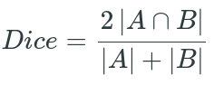
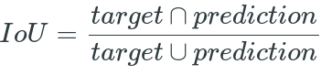
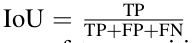

# Semantic_Segmentation
## Introduction

The aim of this Computer Vision task is to assign every pixel of the image to a class.

This is an example of semantic image segmentation


The way we traet standard categorical values, here target will also be one-hot encoded by creating an output channel for all possible classes.

For visulization 


## Loss Functions

The loss functions which are used are cross-entropy loss and soft dice loss. We are well aware of the cross-entropy loss in multi-classfication tasks. Soft dice loss is the extension of the dice coefficents developed for binary data.



Implementation of soft dice loss
```python
def soft_dice_loss(y_true, y_pred, epsilon=1e-6): 
    ''' 
    Soft dice loss calculation for arbitrary batch size, number of classes, and number of spatial dimensions.
    Assumes the `channels_last` format.
  
    # Arguments
        y_true: b x X x Y( x Z...) x c One hot encoding of ground truth
        y_pred: b x X x Y( x Z...) x c Network output, must sum to 1 over c channel (such as after softmax) 
        epsilon: Used for numerical stability to avoid divide by zero errors
    
    # References
        V-Net: Fully Convolutional Neural Networks for Volumetric Medical Image Segmentation 
        https://arxiv.org/abs/1606.04797
        More details on Dice loss formulation 
        https://mediatum.ub.tum.de/doc/1395260/1395260.pdf (page 72)
        
        Adapted from https://github.com/Lasagne/Recipes/issues/99#issuecomment-347775022
    '''
    
    # skip the batch and class axis for calculating Dice score
    axes = tuple(range(1, len(y_pred.shape)-1)) 
    numerator = 2. * np.sum(y_pred * y_true, axes)
    denominator = np.sum(np.square(y_pred) + np.square(y_true), axes)
    
    return 1 - np.mean((numerator + epsilon) / (denominator + epsilon)) # average over classes and batch
```

## Evaluation Metrics

Mean IoU is general evaluation metric used in semantic image segmentation challenges.



IoU score is calculated for each class with which global and mean IoU score is calculated.

This measure can also be represnted in terms of True positives, False Positives and False Negatives.




## Transfer Learning 

As the paper "Semantic Scene Segmentation for Indoor Robot Navigation via Deep Learning" has shown that with the help of transfer learning we can achieve significant results in semantic segmentation for indoor navigation. This paper has used VGG-16 architecure. Paper is published in August 2018. A similar paper "Semantic Segmentation to Develop an Indoor Navigation System for an Autonomous Mobile Robot" which was published recently has also adopted a similar approach by changing the archieture to ResNet which showed resonably increase in accuracy.

Pytorch offers pretrained models like DeepLabv3 ResNet models which could be used for transfer learning with custom dataset for indoor navigation. Adding regularizaton and fine-tuning the model may help in increasing its performance.

Impelementation of Transfer Learning for Semantic segmentation can be found [here](https://github.com/msminhas93/DeepLabv3FineTuning)

